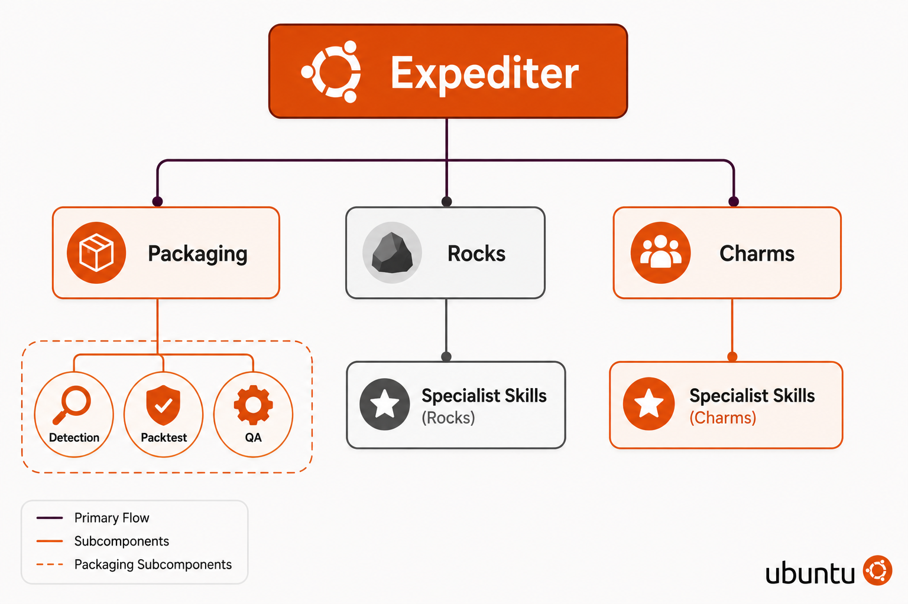

# o7k-expediter



> *Because life's too short to manually package OpenStack releases.*

**o7k-expediter** is an automated pipeline that detects new upstream OpenStack
releases and shepherds them through Debian packaging, builds, Rock (OCI image)
rebuilds, and charm updates, so you don't have to mass-sacrifice your weekends
at the altar of `debian/changelog`.

## How it works

A deterministic state machine (the **expediter**) orchestrates the pipeline.
It dispatches work to **AI-driven managers** who each run a bounded retry
loop.

```text
Upstream release detected
│
▼
┌───────────────┐
│ Expediter │ ← Deterministic. Incorruptible.
│ (state machine) │ (mostly)
└───────┬───────┘
│ dispatches
▼
┌───────────────┐ ┌────────────┐
│ Manager │────▶│ Skill │
│ (retry loop) │◀────│ (markdown) │
└───────┬───────┘ └────────────┘
│
▼
Build passed? ──yes──▶ 🎉
│
no
│
▼
Budget left? ──no───▶ 📧 "Dear human..."
│
yes ──▶ (loop)
```

## Project layout

```text
o7k-expediter/
├── o7k/              # Python modules (expediter, managers, skills, LLM)
├── skills/           # One directory per skill (markdown, not code)
├── managers/         # Stage managers (packager, rockcrafter, charmer)
├── resources/        # YAML configs (projects, gates, routing, models)
└── tests/            # Tests
```

Note: Rockcrafter and charmer managers to be implemented.

---

*Built for the OpenStack team. Powered by RedBull.*
